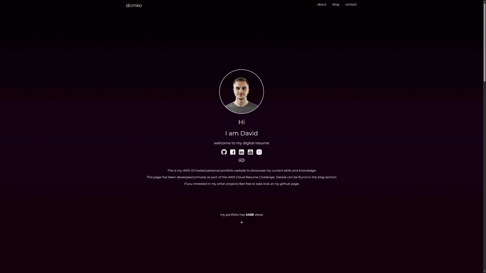

# 🌐 Personal Portfolio Website

Welcome to my personal portfolio website – a responsive and minimal design hosted on **Amazon S3**. This site serves as a central hub for showcasing my skills, certifications, blog, and personal projects.

---

## 📸 Preview

  
*Note: Replace `preview.gif` with an actual image or gif from your project if available.*

---

## 🚀 Live Website

🔗 [View Live Website](http://your-bucket-name.s3-website-region.amazonaws.com)  

---

## 🛠 Tech Stack

- **HTML5** – semantic structure
- **CSS3** – modern layout with Flexbox & media queries
- **JavaScript** – interactivity and responsive elements
- **Amazon S3** – static site hosting
-  **AWS Route 53** - AWS DNS Service
-  **GitHub Actions**  - Automatized GitHub / AWS pipeline

---

## 💡 Features

- 🎨 Minimal, mobile-first responsive design
- 🧠 Sections for certifications, skills, blog, and timeline
- 🗂️ Clean code structure for easy updates and maintenance
- ☁️ Hosted on AWS S3 for fast and reliable delivery

---

## 📁 Folder Structure

```bash
/aws-cloud-portfolio-github
├── index.html
├── css/
│   └── styles.css
├── js.sj   
├── pictures/
│   └── profile.jpg
└── README.md
